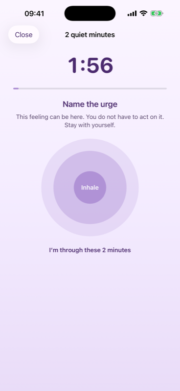
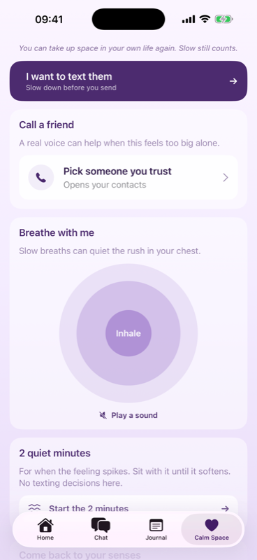
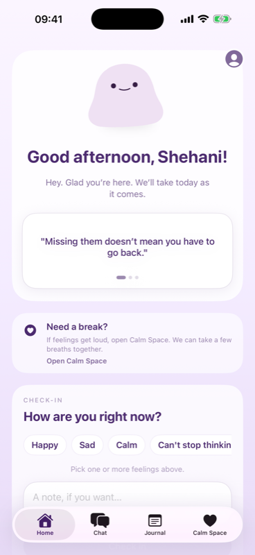
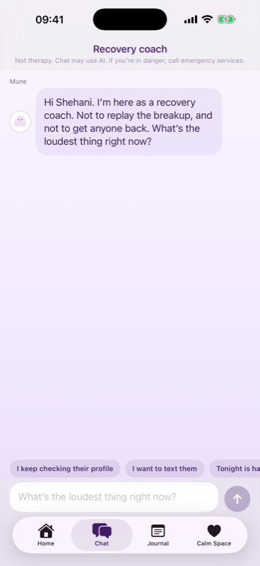
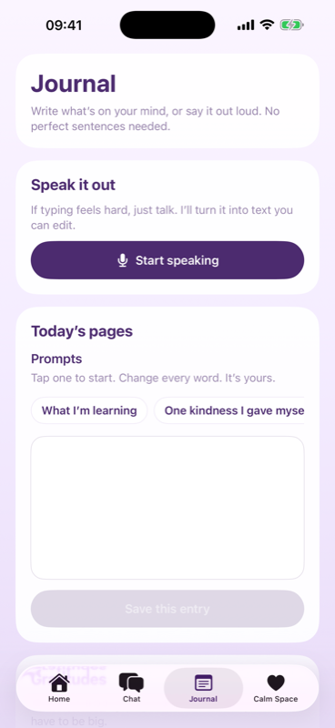
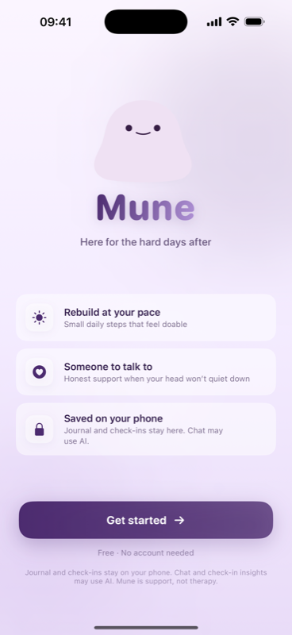

<div align="center">

# Mune

### Heal what's heavy

*A private breakup companion for the hours that hit hardest — especially when your thumb hovers over their name.*

[](https://swift.org)
[](https://developer.apple.com/ios/)
[](https://developer.apple.com/xcode/swiftui/)
[](#)
[](#)

**App Store name:** Mune: Heal What's Heavy &nbsp;·&nbsp; **Subtitle:** Pause before you text them

</div>

---

## App in Action

<div align="center">
<table>
  <tr>
    <td align="center" width="33%">
      <b>Two quiet minutes</b><br><br>
      
    </td>
    <td align="center" width="33%">
      <b>Calm Space</b><br><br>
      
    </td>
    <td align="center" width="33%">
      <b>Home</b><br><br>
      
    </td>
  </tr>
  <tr>
    <td align="center">
      <b>Chat</b><br><br>
      
    </td>
    <td align="center">
      <b>Journal</b><br><br>
      
    </td>
    <td align="center">
      <b>Welcome</b><br><br>
      
    </td>
  </tr>
</table>
</div>

---

## What is Mune?

Mune is a private, local-first iOS companion for the days after a breakup. Most apps in this space count days since last contact. Mune is built for the night itself: one tap slows the urge to reach out, gives you something to do with the feeling, and hands you one small step for the day after.

No account. No subscription. No ads. Support, not therapy.

---

## Features

**I want to text them**
A guided pause when the urge hits. Name the feeling, write the message you will not send, and get a next step. Nothing here is saved or transmitted.

**Two quiet minutes**
A timed urge-surfing exercise paced by breathing. Stay with the spike until it softens. No decisions, nothing saved.

**Calm Space**
Paced breathing, 5-4-3-2-1 grounding, a drawing pad, call-a-friend through the system contact picker, and worldwide crisis links (IASP Find a Helpline + local emergency where known; 988 in the US).

**Talk with Mune**
Breakup-aware AI chat for grief, missing someone, and hard hours. Powered by OpenAI through a Cloudflare Workers proxy. Chat stays in memory only — Mune does not store it.

**Journal**
Write or speak it out. Prompts for when the page feels blank, including Reality Check: name a thought, test it, write a fairer answer. Dictation uses on-device speech recognition so audio never leaves the phone.

**Check-in**
Log how you feel and optionally add a note. See a quiet picture of your week. Insights may use AI when you ask for them.

**Rebuild yourself**
Small daily commitments across body, mind, and people. Counts the days you showed up, not the days you missed.

**Recovery progress**
Periodic self-ratings for pain, intrusive thoughts, contact urge, sleep, loneliness, and sense of self — shown as a trend.

**Healing days**
Optional. Off by default. Framed as care, not a streak to protect.

**Your data**
Export everything as a text file, or delete your space, from Settings. Change your nickname, photo, and healing focus in Profile anytime.

---

## Privacy

| Stays on this device | May leave this device |
|----------------------|------------------------|
| Journal, check-ins, rebuild steps, reality checks, recovery snapshots, drawings, profile | Chat messages, optional check-in context, and nickname — sent through our proxy to OpenAI to generate a reply |

- No account, no tracking identifiers, no analytics SDK, no ads
- Declared App Store privacy types: Name and Other User Content, App Functionality only
- [Privacy Policy](https://shehanish.github.io/Mune/privacy-policy.html) · [Terms of Use](https://shehanish.github.io/Mune/terms-of-use.html)

---

## Tech Stack

| Layer | Technology |
|-------|------------|
| Language | Swift 5.9+ |
| UI | SwiftUI |
| Architecture | MVVM |
| Local storage | SwiftData |
| AI | OpenAI via Cloudflare Workers proxy (`mune-openai-proxy`) |
| Notifications | UserNotifications (local only) |
| Voice | AVFoundation + Speech (`requiresOnDeviceRecognition`) |
| Min iOS | 17.6 · iPhone only |

---

## Running Locally

1. **Clone the repo**
   ```bash
   git clone https://github.com/shehanish/Mune.git
   cd Mune
   ```

2. **Open in Xcode**
   Open `Mune.xcodeproj`

3. **Configure secrets** *(optional — only needed if you call OpenAI directly)*

   The app uses the Cloudflare Workers proxy by default, so AI features work without a local key.
   - Duplicate `Mune/Config/Secrets.example.xcconfig` → `Secrets.xcconfig`
   - Set `MYAPI_KEY = put-your-key-here` only if you set `proxyURL = nil` in `AppConfig.swift`

4. **Build and run**
   Select a simulator or device → `Cmd + R`

---

## Project Structure

```
Mune/
├── AI/                  OpenAI service + insight models
├── Config/              AppConfig, xcconfig files
├── Data/                SwiftData repositories
├── Models/              Entries, crisis resources, healing focus, profile store
├── Recovery/            Navigator, engine, exercises
├── ViewModel/           Home, Chat, Journal, Rebuild, Progress...
├── Views/               Tabs, Calm Space, Auth, Settings, Profile
├── DataExportService    Local text export
└── PrivacyInfo.xcprivacy
```

---

## Crisis Resources

Calm Space, Home, Journal, and Chat can surface **[IASP Find a Helpline](https://www.iasp.info/suicidalthoughts/)** and local emergency numbers where known. US devices may also see **988**. Crisis-signal text is never forwarded to AI. Mune is not a crisis service.

Calm Space ambient audio is from Pixabay; see [`THIRD_PARTY_AUDIO.md`](THIRD_PARTY_AUDIO.md).

---

<div align="center">
  <sub>Built with care · Your breakup story is yours</sub>
</div>
